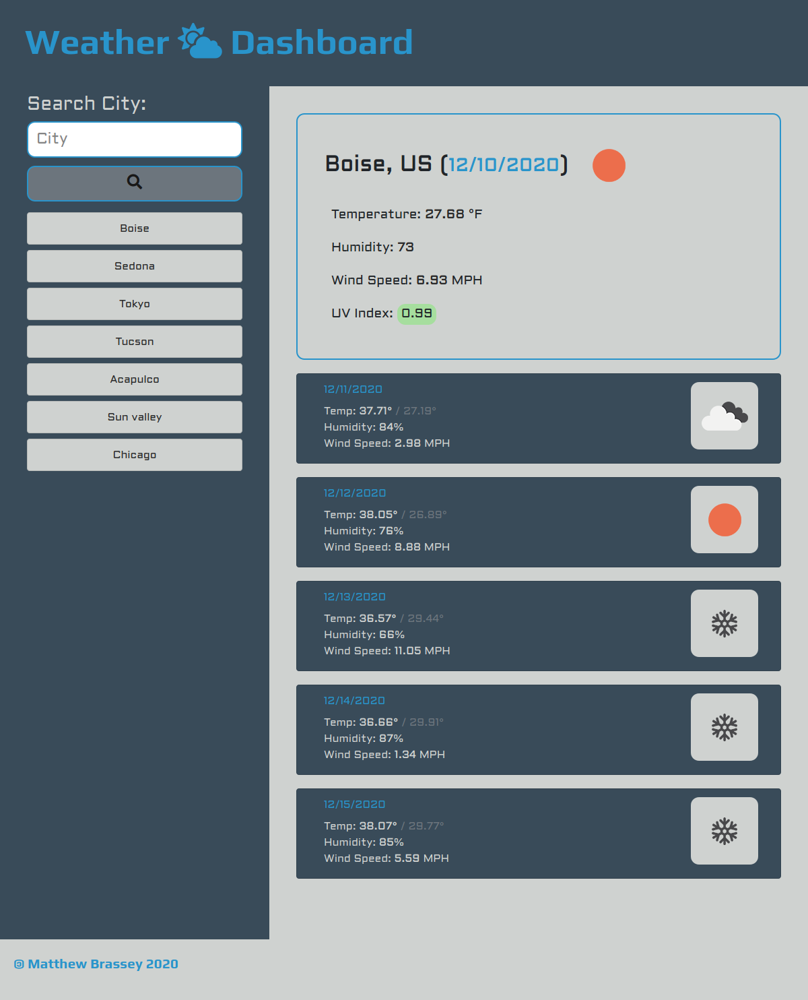

## OpenWeather Dashboard

Weather dashboard concept using OpenWeather API, ipinfo.io API, jQuery/JS/HTML/CSS, packaged by @electron-forge for Windows, Mac & Linux.

#### Issues

- [x] [Initial App](https://github.com/MBrassey/OpenWeather-Dashboard/issues/1)
- [x] [Search for City](https://github.com/MBrassey/OpenWeather-Dashboard/issues/2)
- [x] [City Data](https://github.com/MBrassey/OpenWeather-Dashboard/issues/3)
- [x] [Forecast Data](https://github.com/MBrassey/OpenWeather-Dashboard/issues/4)
- [x] [Stylize](https://github.com/MBrassey/OpenWeather-Dashboard/issues/5)
- [x] [Touch-Up](https://github.com/MBrassey/OpenWeather-Dashboard/issues/6)
- [x] [GeoLocate](https://github.com/MBrassey/OpenWeather-Dashboard/issues/7)

#### Download

[Releases](https://github.com/MBrassey/OpenWeather-Dashboard/releases/tag/1.0.0)

<h6>
:cyclone: Click the image(s) below to view the live <a id="Screenshots" href="https://MBrassey.github.io/OpenWeather-Dashboard/">webapplication</a>
</h6>

[
](https://MBrassey.github.io/OpenWeather-Dashboard/)

#### Questions

Contact me at [matt@brassey.io](mailto:matt@brassey.io) with any questions or comments.

#### License

`OpenWeather Dashboard` is published under the __CC0_1.0_Universal__ license.

> The Creative Commons CC0 Public Domain Dedication waives copyright interest in a work you've created and dedicates it to the world-wide public domain. Use CC0 to opt out of copyright entirely and ensure your work has the widest reach. As with the Unlicense and typical software licenses, CC0 disclaims warranties. CC0 is very similar to the Unlicense.
